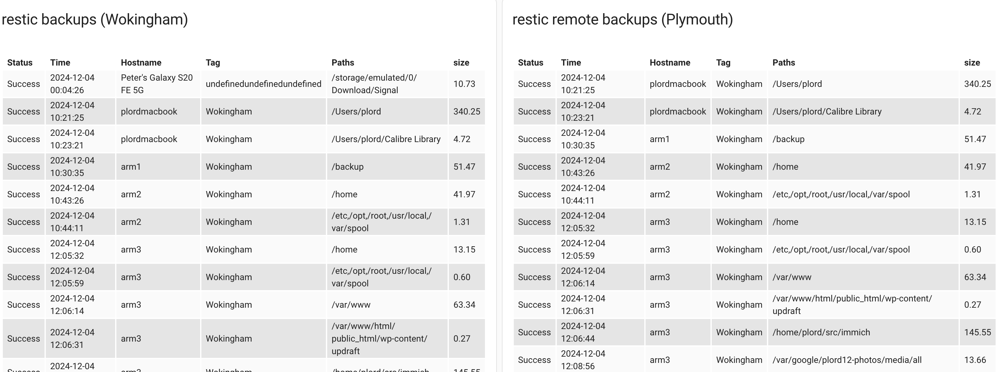
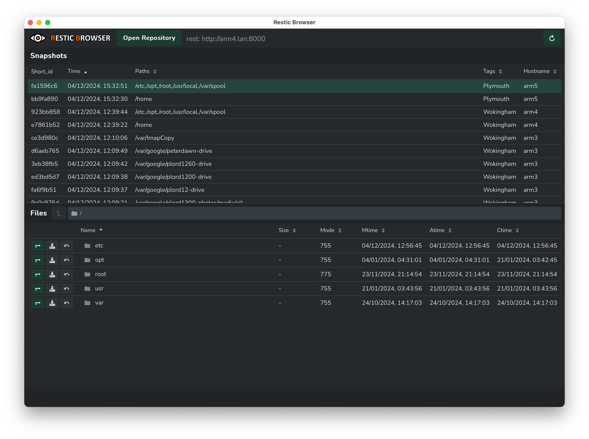

# backups
My backup scripts and documentation

## General priciples

* Use 3-2-1 scheme - at least 3 copys of the data, on 2 media and 1 copy offsite
* Use efficient snapshots - each day backup whats changed
* Keep weekly, monthly and yearly backups
* Use [home assistant](https://www.home-assistant.io/) for status and alerts
* Use cross-platform / open source tools

I mostly use [restic](https://restic.readthedocs.io/en/stable/) with a few additional tools as needed.


## Backup scripts

Each machine I backup has a backup script which uses common functions.  Usually these are started by cron.  For example, on 
server `arm2` I have the crontab -

```
00 01 * * * /home/plord/src/backups/backup_arm2.sh >/home/plord/src/backups/backup_arm2.log 2>&1
```

The script typically includes -

* Use restic to backup to local repository
* Report status to home assistant via MQTT
* Report any errors to home assistant via MQTT

## Local repository

The server `arm4` hosts the local repository on a 4TB SSD drive.  A [rest server](https://github.com/restic/rest-server) is running to allow remote access.

## Offsite repository

The server `arm5` is located offsite and hosts the remote repository on a 4TB SSD drive.  The `copy_remote.sh` script syncronises the two repositories.

## Tags

Snapshots are tagged with the location of the orginating directory.  An additional tak, Keep, is used for old snapshats (no-longer being backed up
but we want to keep the snapshots).

## Periodic repository pruning

The script `prune.sh` can be used to periodically remove outdated data to avoid running out of disk space.

## Home assistant

The local home assistant instance displays the status of both repositories -



The following home assistant rules are of interest -

### Report failures

If a failure message is receieved, call the info script (which logs and alerts via signal) -

```
alias: Restic failure
description: ""
triggers:
  - trigger: mqtt
    topic: homeassistant/sensor/restic/#
conditions:
  - condition: template
    value_template: "{{ trigger.payload is match(\"Failure\") }}"
actions:
  - action: script.info
    metadata: {}
    data:
      message: Restic {{ trigger.payload }}.  Topic:{{ trigger.topic }}
mode: single
```

### Check for old backups

If a backup just isn't happing, we don't get a failure yet the time since the last backup increases.  So this script looks for this case -

```
alias: Test for old backlups
description: If backup is older than 5 days, send an alert
sequence:
  - repeat:
      for_each: >-
        {{ states | selectattr('entity_id', 'match', 'sensor.restic_*') |
        selectattr('attributes.program_version', 'match', 'restic*') |
        map(attribute='entity_id') | list }}
      sequence:
        - if:
            - condition: template
              value_template: >-
                {{ as_timestamp(now())-as_timestamp(state_attr(repeat.item,
                "time")) > 86400*5 }}
          then:
            - action: script.info
              data:
                message: >-
                  Backup "{{ state_attr(repeat.item, "friendly_name") }}" is too
                  old ({{state_attr(repeat.item, "time")}})
  - repeat:
      for_each: >-
        {{ states | selectattr('entity_id', 'match', 'sensor.remote_restic_*') |
        selectattr('attributes.program_version', 'match', 'restic*') |
        map(attribute='entity_id') | list }}
      sequence:
        - if:
            - condition: template
              value_template: >-
                {{ as_timestamp(now())-as_timestamp(state_attr(repeat.item,
                "time")) > 86400*5 }}
          then:
            - action: script.info
              data:
                message: >-
                  Backup "{{ state_attr(repeat.item, "friendly_name") }}" is too
                  old ({{state_attr(repeat.item, "time")}})
```

## Restoring

Restoring of files can be done on the command line or via a GUI such as [resric browser](https://github.com/emuell/restic-browser).



Some useful commands are shown below, but also refer to the [restic docs](https://restic.readthedocs.io/en/stable/).

Note that hosts and paths with spaces will have to be quoted.

### List the latest snapshot of each backup

```
$ restic snapshots --latest 1
repository bd3a858e opened (version 2, compression level auto)
ID        Time                 Host                      Tags        Paths                                         Size
------------------------------------------------------------------------------------------------------------------------------
46b19d06  2024-10-10 17:46:08  arm3                      Wokingham   /var/AmazonCopy                               52.620 GiB

636a8b45  2024-11-08 03:39:08  arm3                      Wokingham   /var/google/plord1250-drive                   5.767 GiB

7a959e03  2024-12-06 00:00:02  plordmacbook              Wokingham   /Users/plord                                  347.906 GiB

60fa2c40  2024-12-06 00:00:02  arm5                      Plymouth    /home                                         30.526 MiB
...
```

### List the snapshots of a specific backup

```
$ restic snapshots --host plordmacbook --path /Users/plord               
repository bd3a858e opened (version 2, compression level auto)
ID        Time                 Host          Tags        Paths         Size
----------------------------------------------------------------------------------
a7d13468  2024-10-10 17:51:05  plordmacbook  Wokingham   /Users/plord  268.631 GiB
7d5464b6  2024-10-31 12:57:21  plordmacbook  Wokingham   /Users/plord  273.460 GiB
28a6fbea  2024-11-03 12:00:02  plordmacbook  Wokingham   /Users/plord  281.143 GiB
908df52a  2024-11-10 00:00:02  plordmacbook  Wokingham   /Users/plord  315.352 GiB
61c5a983  2024-11-17 00:00:02  plordmacbook  Wokingham   /Users/plord  301.680 GiB
384761a7  2024-11-22 00:00:01  plordmacbook  Wokingham   /Users/plord  326.791 GiB
f265c7a1  2024-11-23 01:05:25  plordmacbook  Wokingham   /Users/plord  327.701 GiB
e54ae25d  2024-11-25 07:35:01  plordmacbook  Wokingham   /Users/plord  329.443 GiB
31298c9d  2024-11-26 07:35:00  plordmacbook  Wokingham   /Users/plord  343.440 GiB
86f38b5d  2024-11-27 00:00:02  plordmacbook  Wokingham   /Users/plord  347.895 GiB
9a8af0c1  2024-11-28 07:35:01  plordmacbook  Wokingham   /Users/plord  329.724 GiB
eea15373  2024-11-29 07:35:01  plordmacbook  Wokingham   /Users/plord  329.593 GiB
55989d60  2024-11-30 07:35:02  plordmacbook  Wokingham   /Users/plord  331.843 GiB
c7a9150a  2024-12-01 08:01:14  plordmacbook  Wokingham   /Users/plord  334.443 GiB
fd098d0e  2024-12-02 16:49:03  plordmacbook  Wokingham   /Users/plord  334.999 GiB
733351ee  2024-12-03 00:00:01  plordmacbook  Wokingham   /Users/plord  336.131 GiB
9b61d859  2024-12-04 10:21:25  plordmacbook  Wokingham   /Users/plord  340.246 GiB
4111c125  2024-12-05 00:00:02  plordmacbook  Wokingham   /Users/plord  347.918 GiB
7a959e03  2024-12-06 00:00:02  plordmacbook  Wokingham   /Users/plord  347.906 GiB
----------------------------------------------------------------------------------
19 snapshots
```

### List the contents of a given snapshot

```
$ restic ls 7a959e03 
snapshot 7a959e03 of [/Users/plord] at 2024-12-06 00:00:02.450435 +0000 UTC by root@plordmacbook filtered by []:
/Users
/Users/plord
/Users/plord/.CFUserTextEncoding
/Users/plord/.DS_Store
/Users/plord/.ai
/Users/plord/.ai/bin
/Users/plord/.ai/bin/llava
/Users/plord/.ai/bin/llava/ggml-metal.metal
/Users/plord/.android
/Users/plord/.android/adb_usb.ini
/Users/plord/.android/adbkey
/Users/plord/.android/adbkey.pub
/Users/plord/.anydesk
/Users/plord/.anydesk/.anydesk.trace
/Users/plord/.anydesk/AnyDesk
/Users/plord/.anydesk/AnyDesk/outgoing iPhone (1807481502)-plord (821718307) 0.anydesk
/Users/plord/.anydesk/anydesk.trace
/Users/plord/.anydesk/connection_trace.txt
/Users/plord/.anydesk/global_cache
...
```

### Search for a file or directory

```
$ restic find backup_arm2.sh
repository bd3a858e opened (version 2, compression level auto)
[0:03] 100.00%  83 / 83 index files loaded
Found matching entries in snapshot 8736a232 from 2024-12-04 10:43:26
/home/plord/src/backups/backup_arm2.sh

Found matching entries in snapshot df0c33a7 from 2024-12-04 12:05:32
/home/plord/src/backups/backup_arm2.sh

Found matching entries in snapshot e7861b52 from 2024-12-04 12:39:22
/home/plord/src/backups/backup_arm2.sh

Found matching entries in snapshot bb9fa890 from 2024-12-04 15:32:30
/home/plord/src/backups/backup_arm2.sh
```

### Restore a file

```
$ restic restore 2d664274 --include "/storage/emulated/0/Download/Signal /signal-2024-12-02-00-57-54.backup" --target /tmp
repository bd3a858e opened (version 2, compression level auto)
[0:17] 100.00%  83 / 83 index files loaded
restoring snapshot 2d664274 of [/storage/emulated/0/Download/Signal ] at 2024-12-04 00:04:26.27960027 +0000 UTC by @Peter's Galaxy S20 FE 5G to /tmp
Summary: Restored 6 / 1 files/dirs (5.365 GiB / 5.365 GiB) in 5:04

$ find /tmp/storage/
/tmp/storage/
/tmp/storage/emulated
/tmp/storage/emulated/0
/tmp/storage/emulated/0/Download
/tmp/storage/emulated/0/Download/Signal 
/tmp/storage/emulated/0/Download/Signal /signal-2024-12-02-00-57-54.backup
```

### See whats changed between snapshots

```
$ restic diff 4111c125 7a959e03 | more
comparing snapshot 4111c125 to 7a959e03:

-    /Users/plord/.Trash/.DS_Store
-    /Users/plord/.Trash/Google Keep- Free Note Taking App for Personal Use.webloc
M    /Users/plord/.local/share/signal-cli/data/522489
M    /Users/plord/.local/share/signal-cli/data/522489.d/account.db
M    /Users/plord/.wake.status
M    /Users/plord/.zsh_history
...
```

## Other tools used

The backup scripts also make use of -

* [rclone](https://rclone.org/) to copy files from cloud storage (Google Drive and Google Photos) prior to backing up with restic
* [offlineimap](http://www.offlineimap.org) to download email from imap server prior to backing up with restic
* [mosquitto_pub](https://mosquitto.org/man/mosquitto_pub-1.html) to communicate with home assistant
* [Wireguard VPN](https://www.wireguard.com/) for offsite connectivity

## Testing the backups

The simple script `test-backup.sh` tests the backups by attempting to restore a file from the latest snapshots.
